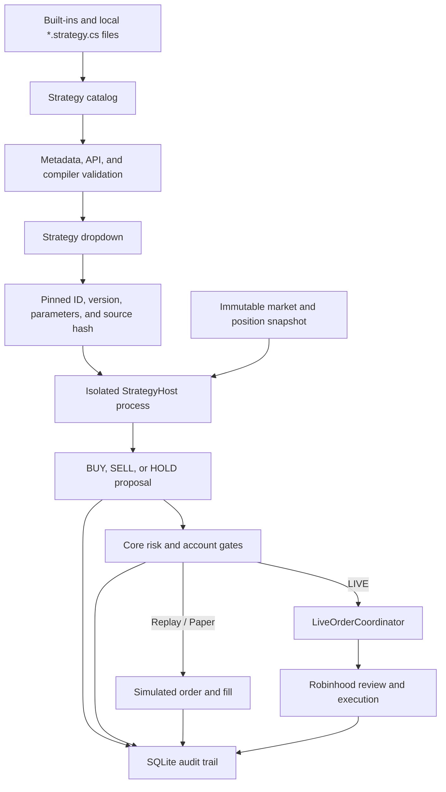

# Script-driven strategy design

> [!IMPORTANT]
> This document describes a proposed feature. Script-driven strategies are not
> implemented in the current release.

PriceSentinel will support selectable, one-file strategy source plugins. A local
strategy file implements a small, versioned contract and appears in a dropdown in
the application. The selected strategy receives immutable market and position
data and returns an actionable `BUY`, `SELL`, or `HOLD` result.

A scripted `BUY` or `SELL` is not merely a chart annotation. In Replay and Paper
Trader it can create a simulated order. In LIVE it can lead to a real Robinhood
order when, and only when, the existing PriceSentinel risk and broker-execution
pipeline accepts it.

## Goals

- One source file represents one strategy.
- Compatible built-in and local strategies appear in the same dropdown.
- Replay, Paper Trader, and LIVE use the same selected artifact and evaluation
  path for equivalent observations.
- Strategy authors can decide when to buy, sell, or hold and can explain each
  decision.
- PriceSentinel retains final control over sizing, buying power, stops, daily
  loss, cooldowns, trading windows, reconciliation, order review, submission,
  fill confirmation, and cancellation.
- Every decision and order can be traced to an exact strategy source artifact.
- Invalid, incompatible, stalled, or crashing strategies fail closed.

## Non-goals

- A strategy cannot call Robinhood or another broker directly.
- A strategy cannot access authentication tokens or broker adapter objects.
- A strategy cannot place an order without host validation.
- A strategy cannot weaken or bypass application risk controls. It may choose to
  hold or sell earlier, which can make behavior more conservative.
- A running session does not hot-reload source edits.
- The first implementation remains single-symbol and selects one strategy. A
  priority-ordered strategy pipeline is a later extension.

## End-to-end architecture



The strategy determines trade direction and timing. The host determines whether
the action is currently legal and safe, how many shares may be traded, and how an
accepted order is reviewed, submitted, monitored, and reconciled.

## Current integration points

The implementation already has the beginning of this boundary:

- `IPriceActionSignalEngine.Evaluate(quotes, position)` returns a
  `StrategyDecision` without calling a broker.
- `PaperTradingEngine` and `LiveExecutionEngine` both accept an injected
  `IPriceActionSignalEngine`. Replay uses the same paper engine as Paper Trader.
- Both engines evaluate host-owned risk independently of the injected strategy.
  `LiveExecutionEngine` produces a broker-neutral intent; only
  `LiveOrderCoordinator` can review and place it.

The registry work should generalize the interface to `ITradingStrategy` and make
strategy injection mandatory instead of allowing each engine to silently create
its own default. The application should resolve the selection once when a session
starts and pass that exact artifact to the relevant engine. Real-time and Replay
session runners only deliver observations and do not need strategy-specific
branches.

`StrategyDecision` and the strategy panel currently contain price-action-specific
RSI and momentum fields. Preserve those for the built-in adapter initially, then
replace the presentation contract with generic named metrics before exposing a
broader public SDK.

## Proposed solution structure

The feature should be separated into explicit contracts, orchestration, and
isolation components:

```text
src/
  PriceSentinel3000.StrategySdk/       Public, broker-free strategy contract
  PriceSentinel3000.StrategyHost/      Restricted worker and source compiler
  PriceSentinel3000.Core/               Risk gates and decision adaptation
  PriceSentinel3000.Application/        Catalog and worker-facing ports
  PriceSentinel3000.Infrastructure/     File catalog and worker transport
  PriceSentinel3000.App/                Dropdown, diagnostics, and composition

samples/
  strategies/
    RsiRebound.strategy.cs
```

Installed local strategies should live under
`%LOCALAPPDATA%\PriceSentinel3000\Strategies`. The application can provide an
**Open Strategies Folder** action and an explicit **Refresh Strategies** action.
Built-in strategies remain compiled with the application but expose the same
descriptor and runtime contract.

## One-file contract

Use ordinary C# source files named `*.strategy.cs`, compiled with a pinned Roslyn
version. Avoid stateful top-level `.csx` scripts. A regular class gives authors
normal compiler diagnostics while making discovery and lifecycle rules explicit.

The public SDK should remain small and must not reference the WPF application,
Robinhood integration, journal implementation, or execution engine. The names
below are illustrative; the behavior is the required part of the contract.

```csharp
[PriceSentinelStrategy(
    Id = "sample.rsi-rebound",
    Name = "RSI Rebound",
    Version = "1.0.0",
    ApiVersion = 1,
    RequiredObservationSeconds = 15,
    RequiredLookbackSeconds = 900)]
public sealed class RsiReboundStrategy : ITradingStrategy
{
    public StrategyProposal Evaluate(StrategyContext context)
    {
        decimal? rsi = Indicators.Rsi(context.ClosePrices, period: 14);

        if (!context.Position.HasPosition && rsi is <= 30m)
        {
            return StrategyProposal.Buy(
                state: "RSI OVERSOLD",
                reason: "RSI(14) reached the configured entry zone.");
        }

        if (context.Position.HasPosition && rsi is >= 65m)
        {
            return StrategyProposal.Sell(
                state: "RSI RECOVERED",
                reason: "RSI(14) reached the configured exit zone.");
        }

        return StrategyProposal.Hold("WAITING", "No entry or exit condition matched.");
    }
}
```

`Evaluate` is synchronous and deterministic. Network requests, disk access, UI
interaction, background work, and wall-clock reads do not belong in strategy
evaluation. The host supplies the source timestamp and all permitted inputs.

## Versioned compatible API

PriceSentinel should publish a `docs/strategy-api-v1.md` reference when the SDK is
implemented. The compiler and runtime must enforce the documented surface;
documentation by itself is not a security control.

The initial API should expose only immutable values and pure calculations:

| Capability | Replay | Paper | LIVE | Notes |
| --- | ---: | ---: | ---: | --- |
| Read symbol and source timestamp | Yes | Yes | Yes | Time comes from the supplied observation, not the system clock. |
| Read ordered quote/OHLCV observations | Yes | Yes | Yes | Availability and freshness are declared in the context. |
| Read current position quantity, average price, and open timestamp | Yes | Yes | Yes | Read-only, single-symbol snapshot. |
| Read declared strategy parameters | Yes | Yes | Yes | Values are validated and pinned at session start. |
| Use approved deterministic indicators and math helpers | Yes | Yes | Yes | Start with functions already supported and tested by Core. |
| Return `BUY` | Yes | Yes | Yes | Actionable, but still subject to host entry gates. |
| Return `SELL` | Yes | Yes | Yes | Actionable, but quantity and execution remain host-owned. |
| Return `HOLD` | Yes | Yes | Yes | Produces no order. |
| Attach state, confidence, and human-readable reasons | Yes | Yes | Yes | Persisted for inspection and audit. |
| Submit or cancel an order directly | No | No | No | Only the host execution pipeline can do this. |
| Select unrestricted order quantity or ignore buying power | No | No | No | Existing account and position-size controls remain authoritative. |
| Disable stop-loss, daily-loss, cooldown, or reconciliation rules | No | No | No | Host protections are non-bypassable. |
| Access credentials, broker clients, filesystem, network, processes, or UI | No | No | No | Not part of the SDK and denied by the worker boundary. |
| Use arbitrary package references, reflection, native calls, threads, or dynamic loading | No | No | No | Rejected by policy and isolated at runtime. |
| Read `DateTime.Now`, uncontrolled randomness, or mutable global state | No | No | No | These would break deterministic replay. |

The first SDK can expose a deliberately small helper set such as RSI, percentage
change, rolling minimum/maximum, and immutable OHLCV/quote access. New calls are
added through a new compatible API version with documented behavior and tests.
Removing or changing a call requires a major API version.

## Action semantics

### `BUY`

The strategy asks PriceSentinel to open a long position now. It supplies the
state, confidence, and reasons, but not an unrestricted broker request.

- Replay fills according to the versioned replay simulation model.
- Paper Trader fills according to the paper bid/ask and settlement model.
- LIVE passes through buying-power, position-size, quantity, maximum-entry,
  cooldown, re-entry-price, market-hours, symbol-tradability, open-order,
  fractional-share, and broker-review checks before submission.
- A blocked LIVE buy is journaled as blocked and no order is submitted.

### `SELL`

The strategy asks PriceSentinel to close the current long position now.

- Replay and Paper Trader create a simulated exit when a paper position exists.
- LIVE determines the sellable quantity from the authoritative Robinhood
  position, reviews the exact intent, submits it through `LiveOrderCoordinator`,
  and waits for terminal broker state.
- The script cannot claim that an order filled. Chart markers and account state
  change only after the applicable simulator or Robinhood confirms a fill.
- A strategy may sell before a host stop is reached, but it cannot prevent an
  independent stop-loss or daily-loss liquidation.

### `HOLD`

No order is requested. The decision and its reasons remain auditable.

## Discovery and dropdown behavior

1. The catalog discovers built-ins and `*.strategy.cs` files without executing
   strategy code merely to obtain display metadata.
2. Literal metadata is parsed and validated: stable ID, display name, semantic
   version, SDK API version, required observation interval, required lookback,
   scope, and parameter declarations.
3. Duplicate IDs, unsupported API versions, invalid metadata, compilation
   errors, and prohibited calls make the item unavailable. The dropdown shows a
   concise status and exposes full diagnostics.
4. Valid items appear with an origin and eligibility label, for example
   `BUILT-IN`, `LOCAL SCRIPT`, `REPLAY/PAPER`, or `LIVE APPROVED`.
5. Strategy selection and parameters may change only while the operating mode is
   OFF. Starting a session resolves and pins one exact artifact.
6. Refreshing the folder never changes the strategy used by an active session.

The selected strategy ID and parameters should be ordinary user preferences, but
LIVE approval belongs to the exact content hash rather than only the filename or
declared version.

## Compilation and validation

The compiler service should:

- Normalize the source as UTF-8 and calculate SHA-256 before compilation.
- Pin the Roslyn/compiler version and use deterministic compilation.
- Reference only the Strategy SDK and an intentionally curated subset of .NET.
- Require exactly one concrete `ITradingStrategy` implementation.
- Reject top-level statements, `unsafe`, `#r`, `#load`, native interop, dynamic
  assembly loading, reflection, thread creation, process control, direct I/O,
  networking, and undeclared dependencies.
- Run analyzers that report PriceSentinel-specific diagnostics, such as an
  incompatible API call or nondeterministic clock access.
- Cache successful compilation by SDK version, compiler version, and source hash.

Reference restrictions and analyzers provide good diagnostics and reduce
accidental misuse, but they are not a security boundary for arbitrary C#. Runtime
isolation remains required.

## Isolation and LIVE approval

Do not execute source strategies inside the WPF process. A collectible
`AssemblyLoadContext` can help unload dependencies, but it neither contains
malicious code nor reliably terminates a hung strategy.

Run the selected artifact in a dedicated `StrategyHost` process:

- Communicate through a narrow, versioned DTO protocol over a local named pipe.
- Send only immutable strategy inputs; never send OAuth tokens, broker clients,
  service providers, application paths, or writable account objects.
- Serialize evaluation calls for each `(session, strategy, symbol)` instance.
- Enforce evaluation deadlines plus process CPU, memory, child-process, and
  lifetime limits.
- Treat an invalid response, timeout, crash, protocol mismatch, or unexpected
  process exit as a failed evaluation.
- Apply an OS security boundary for untrusted code, such as an AppContainer or a
  dedicated restricted identity. A normal child process running as the same user
  is useful crash containment but is not sufficient credential isolation.

Before a local script becomes LIVE eligible, require the user to:

1. Compile the exact source successfully.
2. Run it in Replay and Paper Trader.
3. Review its identity, version, parameters, requested data, and SHA-256.
4. Explicitly approve that exact hash for LIVE.

Any edit produces a new hash and removes LIVE eligibility until the new artifact
is reviewed. Selecting LIVE should clearly display the selected strategy and hash
status before the session can arm.

## Session and failure behavior

At session start, PriceSentinel should persist and then freeze:

- Strategy ID and display name
- Declared strategy version
- Source SHA-256
- Strategy SDK/API version
- Compiler or interpreter version
- Parameter names and values
- Required interval and lookback
- Simulation-model version

Runtime behavior is fail-closed:

- Metadata or compilation failure: do not start the session.
- Insufficient lookback: return a visible warming-up `HOLD` state.
- Unsupported or malformed result: reject it and submit no order.
- Worker timeout or crash: block new entries, journal the fault, and stop or
  disarm LIVE according to session state.
- Existing hard-risk conditions remain evaluated by Core independently of the
  script so a script failure cannot disable host-owned protection.
- Repeated faults require explicit user restart after the problem is corrected.

## Persistence and audit changes

Add strategy provenance to sessions and copy it to decisions, orders, and fills
or make those records reference an immutable session-strategy record. At minimum,
persist:

```text
strategy_id
strategy_version
strategy_source_sha256
strategy_api_version
strategy_runtime_version
strategy_parameters_json
simulation_model_version
```

The activity journal should distinguish among:

- The strategy's requested action and reasons
- A host risk rule blocking that request
- A simulated order/fill
- A reviewed LIVE order and its broker state
- A worker or compatibility failure

This separation prevents a `BUY` signal from being mistaken for a submitted or
filled order.

## Implementation sequence

1. **Registry foundation:** introduce a generic `ITradingStrategy` descriptor and
   factory, register the current price-action engine as `builtin.price-action`,
   add the dropdown, and explicitly inject the selected built-in into both
   execution engines.
2. **Provenance:** persist the selected ID, version, parameters, and artifact hash
   on sessions and trading records before accepting external source.
3. **Strategy SDK:** add immutable DTOs, actionable `BUY`/`SELL`/`HOLD` proposals,
   metadata attributes, compatibility documentation, and a sample strategy.
4. **Catalog and compiler:** discover one-file strategies, validate metadata and
   prohibited APIs, compile deterministically, cache by hash, and surface useful
   diagnostics.
5. **Replay and Paper worker:** execute scripts out of process with deadlines and
   prove decision parity, restart behavior, and fault containment without broker
   access.
6. **LIVE isolation and promotion:** add the OS-enforced boundary and exact-hash
   approval flow, then route accepted proposals through the unchanged LIVE risk
   and order coordinator.
7. **Multiple strategies:** after the single-strategy path is stable, add a
   deterministic priority policy for resolving conflicting proposals and persist
   every contributing decision.

## Verification requirements

- Contract tests for every published SDK call and every prohibited capability.
- Golden compilation tests for compatible and incompatible sample files.
- Deterministic tests proving the same artifact and observations produce the same
  proposal in repeated runs.
- Cross-mode tests proving Replay, Paper Trader, and LIVE reach the same strategy
  proposal before mode-specific fill and broker gates.
- Tests proving scripted `BUY` and `SELL` can create simulated trades.
- LIVE tests proving accepted scripted actions reach broker review and rejected
  actions never reach placement.
- Tests proving scripts cannot bypass sizing, stops, daily loss, cooldown,
  tradability, open-order, reconciliation, or idempotency controls.
- Timeout, crash, malformed-response, source-edit, hash-approval, duplicate-ID,
  and unsupported-API tests.
- A raw OHLCV regression corpus with documented positive and negative examples
  for each shipped strategy.

## Industry precedents

This design follows an established financial-software pattern while preserving
PriceSentinel's broker-isolation boundary:

- [TradingView Pine strategies](https://www.tradingview.com/pine-script-docs/concepts/strategies/)
  use a purpose-built language for historical and real-time strategy evaluation.
- [MetaTrader MQL5 Expert Advisors](https://www.mql5.com/en/docs/mql5_guide)
  are compiled trading programs discovered by the terminal.
- [NinjaTrader NinjaScript strategies](https://ninjatrader.com/support/helpguides/nt8/developing_strategies.htm)
  are C#-based compiled strategies with selectable configuration.
- [QuantConnect LEAN algorithms](https://www.quantconnect.com/docs/v2/writing-algorithms/key-concepts/algorithm-engine)
  keep market data, portfolio state, and brokerage handling under the host engine.

Relevant platform guidance for the isolation design:

- [.NET secure coding guidelines](https://learn.microsoft.com/en-us/dotnet/standard/security/secure-coding-guidelines)
- [.NET plugin architecture](https://learn.microsoft.com/en-us/dotnet/core/tutorials/creating-app-with-plugin-support)
- [Windows AppContainer isolation](https://learn.microsoft.com/en-us/windows/win32/secauthz/implementing-an-appcontainer)
- [Windows Job Objects](https://learn.microsoft.com/en-us/windows/win32/procthread/job-objects)
