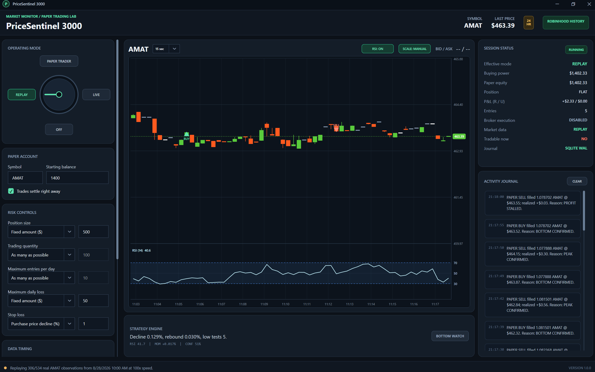

# PriceSentinel 3000

A Windows desktop application that connects to Robinhood Agentic Trading for
real-time price monitoring, historical playback, paper-first strategy research,
and guarded live execution of a user-selected stock or ETF.

*Historical Replay mode using Robinhood price history and simulated paper fills.*

See [Architecture](docs/architecture.md) for the project boundaries, runtime
flows, and LIVE safety invariants. Security concerns should follow the private
reporting guidance in [Security](SECURITY.md).

## Reviewer tour

A Robinhood Agentic Trading account is required to run the connected workspace,
but the solution builds and its deterministic tests run without Robinhood
credentials. For a quick code review:

1. Start with [Architecture](docs/architecture.md) for the dependency direction
   and safety boundaries.
2. Review `PriceSentinel3000.Core` for strategy, risk, paper-account, indicator,
   and chart calculations that do not depend on WPF or Robinhood.
3. Review `PriceSentinel3000.Application` for real-time ingestion, Replay pacing,
   and the guarded LIVE order lifecycle.
4. Review `PriceSentinel3000.Infrastructure` for Robinhood MCP/OAuth, DPAPI,
   SQLite, and JSON adapter implementations.
5. Review the WPF `Views`, `Styles`, and `Themes` folders for the modular desktop
   presentation, then run the three boundary-specific test projects for executable
   safety examples.

> [!WARNING]
> This project is experimental software, not financial advice. Trading involves
> substantial risk of loss. Validate every strategy in Paper Trader and Replay
> before considering live execution.

## Install on Windows

Download the `PriceSentinel3000-<version>-win-x64-setup.exe` asset from the
[latest GitHub release](https://github.com/abiemann/PriceSentinel3000/releases/latest).
The installer is self-contained for Windows x64, so it does not require a
separate .NET installation. It installs for the current Windows user without an
administrator prompt and creates a Start menu shortcut; a desktop shortcut is
optional.

Each release also includes a `SHA256SUMS.txt` file and build-provenance record.
The installer is currently unsigned, so Windows may show an **Unknown publisher**
or Microsoft Defender SmartScreen warning. The checksum verifies that a download
matches the GitHub release asset, but it is not a substitute for a trusted
publisher signature.

Upgrades and uninstalling preserve the journal, preferences, and encrypted
Robinhood session under `%LOCALAPPDATA%\PriceSentinel3000`. Delete that folder
manually only when you intentionally want to remove local PriceSentinel data and
saved authorization.

## Status

The current development build adds an auditable, explicitly armed LIVE equity
execution path to the authenticated Robinhood data foundation:

- OFF / Replay / Paper Trader / LIVE rotary mode selection, with OFF at startup
- Paper Trader polls real Robinhood quotes at the configured interval, evaluates
  a deterministic reactionary strategy, and can never submit a real order
- Warm-start history covers the chart window plus the RSI(14) lookback required
  by every selectable candle interval; configurable delayed-lookback
  reconciliation uses real 15-second Robinhood equity bars
- Replay accepts a ticker plus an exact local date/time and emits that historical
  15-second window as though each observation has just arrived; it can be paused,
  resumed, or stopped without losing the captured chart and paper-account state
- Replay local start/end range (up to 24 hours) and playback speed (1x-100x)
  are tunable
- A tunable 5-15 minute rolling buffer is analyzed as individual one-minute
  blocks and as a whole
- Bottom detection combines a meaningful decline, lingering or separated
  low-zone touches, a confirmed positive turn, and simple-average RSI(14)
- Peak detection combines open-position profit, repeated peak or pullback
  evidence, negative momentum, RSI context, and a five-minute profitable-stall exit
- Live-price paper buys fill at the observed ask and sells at the observed bid.
  Historical Replay has no bid/ask series, so its simulated fills use the bar
  close; no fill is generated from a stale closed-market quote
- Paper sale proceeds can either settle immediately or use a simulated equity
  T+1 schedule. Delayed proceeds remain in paper-account equity but cannot fund
  another buy until 9:30 AM Eastern on the next weekday; exchange holidays are
  not yet modeled
- Paper position sizing supports a fixed dollar amount or account percentage,
  plus "As many as possible" or a user-entered "No more than" share limit
- Maximum entries, maximum daily loss, purchase-price percentage/total-position
  dollar stop loss, a 30-second re-entry cooldown, and a post-sell price deadband
  are enforced before simulated execution
- The WPF chart renders selectable 15-, 30-, 60-, or 120-second candlesticks.
  Replay preserves Robinhood's true OHLC observations while larger intervals
  aggregate them into continuous candles; Paper Trader combines incoming quotes
  with reconciled history. The chart also shows current price and bid/ask
- The chart labels simulated BUY and SELL fills, while Session Status shows paper
  buying power, equity, position, realized/unrealized P&L, and entry count
- Optional RSI(14), minute-by-minute time labels, cursor crosshairs, and Auto or
  drag-adjusted Manual Y-axis scaling support visual inspection
- OFF collapses the configuration tiles under the rotary selector. Selecting
  Replay, Paper Trader, or an acknowledged LIVE mode reveals the relevant controls;
  LIVE retains polling/buffer controls while hiding Replay-only date and speed fields
- SQLite WAL journaling records sessions, observations, every strategy decision,
  paper orders, fills, position snapshots, activities, and idempotent LIVE order events
- LIVE enters disarmed, then **Start Live Trader** reconciles the agentic account,
  buying power, position, symbol tradability, existing orders, daily loss baseline,
  and daily entry count before it can arm
- If Robinhood already holds the selected symbol, LIVE shows the quantity, average
  purchase price, and current estimated sell price before doing anything. The user
  can request an immediate reviewed market sale, adopt the position and wait for a
  profitable strategy exit, or cancel startup without changing the position. New
  BUY orders remain locked out until a PriceSentinel SELL is fully filled and
  Robinhood independently confirms the symbol is flat with no open order
- A LIVE strategy decision must first pass local risk, arming, regular-hours,
  tradability, and fractional-share gates before its order intent reaches
  Robinhood review; missing/malformed review data, any non-empty broker alert,
  stale prices, excessive review-price drift, ambiguous acknowledgements, and
  duplicate/open orders fail closed
- LIVE uses regular-hours GFD market orders with a stable idempotency reference;
  STOP disarms immediately, requests cancellation, and briefly polls the broker
  because cancellation is asynchronous; closing the app with unresolved order
  state requires an explicit exit confirmation after a Robinhood warning
- Startup silently restores a saved Robinhood session when possible; otherwise
  the welcome dialog offers EXIT or LOGIN before opening safely in OFF mode
- The first LIVE selection still shows the loss warning before entering disarmed LIVE
- Friendly status guidance distinguishes REAL TIME, MARKET CLOSED, REPLAY,
  AUTHORIZING, and OFFLINE states

Paper Trader and Replay now create simulated trades from real Robinhood prices.
The current thresholds are documented research defaults inferred from the example
charts; they are a premise to test, not evidence of profitability. LIVE can submit
real equity orders only after the warning is accepted and the user explicitly
starts a fully reconciled LIVE session.

## Shared strategy, guarded execution

Replay, Paper Trader, and LIVE feed their rolling `MarketQuote` history and current
position context into the same deterministic
[`PriceActionSignalEngine`](src/PriceSentinel3000.Core/Strategy/PriceActionSignalEngine.cs).
It produces the shared `BOTTOM CONFIRMED` buy and `PEAK CONFIRMED` or
`PROFIT STALLED` sell decisions. The selectable chart candle interval is a display
setting and does not select a different trading strategy.

What happens after a decision depends on the operating mode:

- [`PaperTradingEngine`](src/PriceSentinel3000.Core/PaperTrading/PaperTradingEngine.cs)
  applies the configured paper-account risk controls and creates simulated fills
  for Replay and Paper Trader. Their chart markers represent completed simulated
  fills, not merely an unexecuted strategy signal.
- [`LiveExecutionEngine`](src/PriceSentinel3000.Core/LiveTrading/LiveExecutionEngine.cs)
  applies corresponding limits against the authoritative Robinhood account,
  position, buying power, and available shares before creating a broker-neutral
  order intent.
- [`LiveOrderCoordinator`](src/PriceSentinel3000.Application/LiveTrading/LiveOrderCoordinator.cs)
  owns Robinhood review, idempotent placement, polling, reconciliation, and
  cancellation. A LIVE chart marker appears only after Robinhood reports an
  actual fill; a valid strategy signal can be blocked without producing a marker.

Replay and LIVE should therefore make logically consistent decisions from
equivalent observations, but they need not fill at the same price or timestamp.
Replay uses historical bar closes, while LIVE uses fresh bid/ask data and adds
market-hours, tradability, broker-state, fractional-share, and pre-trade-review
gates. Executable examples live in
[`PriceActionSignalEngineTests`](tests/PriceSentinel3000.Core.Tests/Strategy/PriceActionSignalEngineTests.cs)
and
[`LiveOrderCoordinatorTests`](tests/PriceSentinel3000.Application.Tests/LiveTrading/LiveOrderCoordinatorTests.cs).

## Paper Trader workflow

1. On the first startup, click **LOGIN** and complete Robinhood's hosted browser
   authorization. Being signed in is only the first step: finish the on-screen
   connection approval and wait for the PriceSentinel completion page.
   PriceSentinel never asks for or stores a Robinhood password. Later launches
   silently restore the encrypted saved session and open the workspace directly.
2. Select **Paper Trader**, enter a stock or ETF symbol and paper starting balance,
   configure the risk and timing settings, then click **Start Paper Trader**.
3. When available, the app requests 33–43 minutes of real 15-second warm-start
   history: the configured 5–15 minute buffer plus 28 minutes needed to warm
   RSI(14) for the longest selectable candle interval. It then obtains the current
   quote and polls it at the configured interval.
4. At each reconciliation interval, the app requests the configured lookback
   window ending behind real time by the completion delay. This avoids treating a
   still-forming historical bar as final. Matching timestamps are verified,
   corrections replace old values, and missing bars are added to the ring buffer.
5. Each fresh quote evaluates the block/whole-buffer strategy. Confirmed entries
   and exits update only the in-memory paper account, then persist the decision,
   order, fill, and position snapshot to SQLite.
6. If the newest venue timestamp is old, the app says **MARKET CLOSED** and pauses
   strategy decisions and paper fills.

There is no generated-price fallback. If authorization, Robinhood, or the network
is unavailable, the session stops and reports the failure.

## LIVE workflow

1. Resolve any existing open order for the selected symbol; an open order blocks
   startup. An existing long position instead opens a confirmation dialog showing
   Robinhood quantity, average cost, and the current estimated sell-side price.
2. Select **LIVE**, read the loss warning, and choose **I AGREE**. This enters LIVE
   mode but does not arm execution or submit an order.
3. Configure conservative risk limits, then choose **Start Live Trader**. The app
   fetches the account from Robinhood instead of using the paper starting balance.
4. For an existing position, choose **Sell Now**, **Wait for the next profitable
   exit**, or **Cancel Live Start**. Immediate sale still goes through Robinhood
   review, idempotent placement, polling, and reconciliation. Monitoring treats
   the position as newly adopted and enters exit logic before any new BUY. It is
   blocked when the configured stop loss or daily-loss limit would liquidate the
   position immediately. Cancel submits nothing and leaves LIVE disarmed. If an
   exit remains pending, is only partially filled, or ends unsuccessfully, entry
   stays blocked and LIVE stops or remains disarmed for manual review. A completed
   exit releases the entry lock only after Robinhood also reports no remaining
   position and no open order.
5. LIVE arms only after account, balance, buying power, tradability, position,
   open-order, daily-entry, daily-loss, and any existing-position recovery checks
   succeed. Broker state and the quote are refreshed after the dialog so a changed
   position cannot be acted upon using stale confirmation.
6. A strategy signal must pass the app's local risk gates before it can create an
   intent. That intent must also pass arming, regular-hours, tradability, and
   fractional-share gates before Robinhood reviews the exact order. The app records
   and displays the market-data disclosure and blocks every non-empty pre-trade
   alert before placement.
7. After submission, the app polls the broker order, blocks duplicate signals,
   records state transitions and fills, and refreshes the authoritative position.
8. **STOP** disarms the session and requests cancellation of a PriceSentinel order.
   Robinhood cancellation is asynchronous, so always confirm the final order and
   position in Robinhood. An order can fill while cancellation is in flight. If
   shutdown cannot confirm a terminal state, the app pauses closing and requires
   explicit confirmation before exiting.

LIVE is experimental and not production-proven. The first market-hours validation
should use the smallest practical position, one maximum entry, and direct Robinhood
monitoring. Market orders prioritize speed but do not guarantee an execution price.

## Strategy research defaults

The first deterministic detector uses the supplied labeled screenshots as a
starting hypothesis:

- simple-average RSI period: 14 observations
- low/high touch-zone tolerance: 0.06%
- minimum pre-turn swing: 0.10%
- minimum 20-second reversal confirmation: 0.025%
- bottom RSI confirmation: at or below 48 and no longer falling
- minimum profitable peak exit: 0.04% before bid-side spread impact
- profitable-stall fallback: five minutes with non-positive momentum
- minimum movement from the previous sell before re-entry: 0.10% in either direction

These constants deliberately live in the strategy core and every decision stores
its confidence and human-readable evidence. Replay results should be used to tune
them later; they are not a promise that the labeled regions can be captured live.

## Replay workflow

1. After the required startup login, select **Replay** and enter the ticker,
   local date (`yyyy-MM-dd`), local start/end times (`HH:mm`), and playback
   speed, then click **Start Replay**.
2. One bounded request loads actual 15-second Robinhood bars for precisely that
   start/end window, using Robinhood's `24_5` historical bounds.
3. The returned observations are replayed in source-time order. Each historical
   price enters the normal ring buffer as a newly observed event, with delays
   compressed by the selected speed.
4. **Pause** freezes playback while preserving the chart, buffer, strategy, and
   paper account. **Resume** continues with the next historical observation.
5. Replay uses the same paper account, strategy, risk controls, fill model, chart
   markers, and journal as Paper Trader, making a historical run reproducible.

Replay does not depend on a previously recorded Paper Trader session and never
uses the former synthetic data.

## Authentication and local data

Robinhood is connected through the official Streamable HTTP MCP endpoint and OAuth
authorization flow. PriceSentinel dynamically registers as a native desktop client
and uses a loopback callback; there is no separate developer-app registration page.
The client pins Robinhood's currently supported MCP `2025-11-25` handshake instead
of probing the newer `server/discover` method.
The app allows up to five minutes for interactive browser authorization. While the
browser is open, the disabled LOGIN button reads
**WAITING FOR APPROVAL**; EXIT cancels the attempt. If authorization times out,
LOGIN becomes available for a clean retry.

At startup, a cached access token and dynamic client registration are tried without
permitting an interactive browser redirect. When present, a cached refresh token
can assist that reconnection. A verified cached connection opens the main window
directly. If the cache is missing, invalid, revoked, corrupt, or cannot be verified,
the welcome dialog appears and offers LOGIN or EXIT.

The OAuth client cache format was updated with the MCP C# SDK 2.0 migration. The
first run after upgrading re-registers PriceSentinel once; this does not modify
authorization for Codex, Claude, or another MCP client.

Access/refresh tokens and dynamic client registration are encrypted with Windows
Data Protection API for the current Windows user at:

~~~text
%LOCALAPPDATA%\PriceSentinel3000\robinhood-tokens.dat
%LOCALAPPDATA%\PriceSentinel3000\robinhood-client.dat
~~~

The SQLite journal is stored at:

~~~text
%LOCALAPPDATA%\PriceSentinel3000\journal.db
~~~

Editable Paper Account, risk, timing, and Replay inputs are restored from:

~~~text
%LOCALAPPDATA%\PriceSentinel3000\preferences.json
~~~

The preferences file contains ordinary UI values only. Robinhood credentials and
tokens are never written to it.

The journal uses normalized tables, indexed symbol/timestamp lookups, prepared
inserts, short transactions, and write-ahead logging. Broker passwords are never
stored in the database.

## Solution layout

~~~text
PriceSentinel3000.sln
src/
  PriceSentinel3000.App/             WPF presentation, composition, and workspace coordination
  PriceSentinel3000.Application/     Session timing, LIVE order workflow, and app-facing ports
  PriceSentinel3000.Core/            Market, paper-account, strategy, and risk models
  PriceSentinel3000.Infrastructure/  Robinhood MCP OAuth/data and SQLite adapters
tests/
  PriceSentinel3000.Core.Tests/            Deterministic domain and strategy tests
  PriceSentinel3000.Application.Tests/     Session and LIVE order workflow tests
  PriceSentinel3000.Infrastructure.Tests/  Robinhood, OAuth, preferences, and SQLite tests
~~~

Dependencies point inward: App composes Application with Infrastructure,
Application provides UI-agnostic workflows against Core contracts,
Infrastructure implements external-data and storage ports, and Core remains
independent of WPF, Robinhood, and SQLite. The market-data and journal contracts
retain an asset-class boundary so a future crypto adapter can reuse the buffer
and persistence engine.

## Development

Requirements:

- Visual Studio 2026 with the .NET desktop development workload
- .NET SDK 10.0.302 or a newer .NET 10 feature band; `global.json` rolls forward
  within .NET 10 while excluding prerelease SDKs
- A Robinhood account eligible for Agentic Trading access

Open `PriceSentinel3000.sln` in Visual Studio, or use:

~~~powershell
dotnet restore PriceSentinel3000.sln
dotnet build PriceSentinel3000.sln --configuration Release --no-restore
dotnet test PriceSentinel3000.sln --configuration Release --no-build
~~~

The Windows CI workflow runs the same Release build with warnings promoted to
errors and executes the complete test suite on every pull request and push to
`main`.

Publishing a numeric GitHub release tag such as `1.1` or `v1.1.0` starts the
Windows release workflow. It builds and tests the exact tagged source, creates a
self-contained x64 publish, compiles the Inno Setup installer, and attaches the
installer, SHA-256 checksums, and provenance to the release. The existing `1.0`
release can be packaged once through the workflow's manual `tag` input.

For an older tag that predates the packaging files, the workflow uses the exact
workflow commit for the installer definition and artwork while compiling only
the tagged application source. Both commits are recorded in the provenance
asset; the tag itself is never moved or rewritten.

The workspace always starts OFF after the required Robinhood connection succeeds.
Accepting the LIVE warning makes LIVE the effective mode while broker execution
remains disarmed. **Start Live Trader** performs the broker preflight and arms the
session only when every check succeeds; confirmed signals can then submit real
orders to the connected Robinhood agentic account.

## License

PriceSentinel 3000 is available under the [MIT License](LICENSE).

Copyright (c) 2026 Alexander Biemann.
