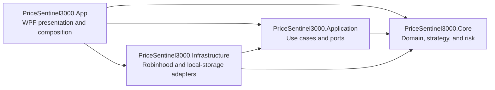
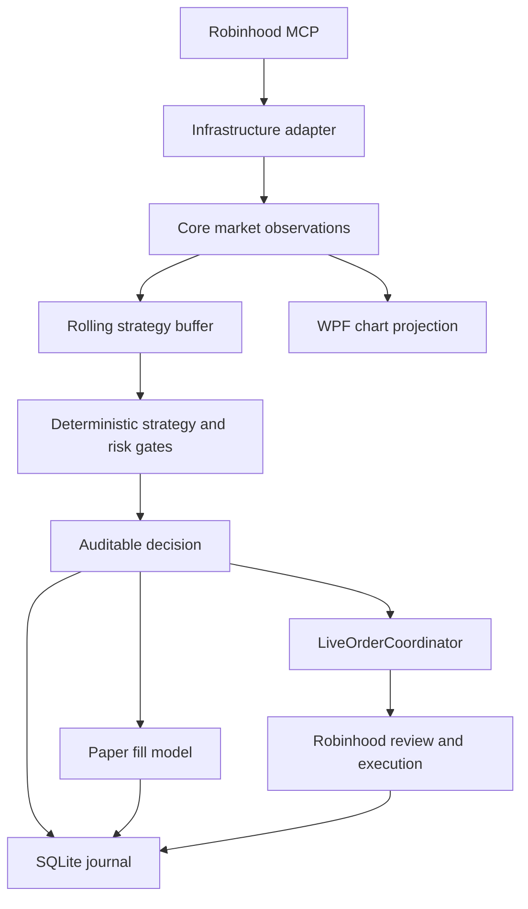

# PriceSentinel 3000 architecture

PriceSentinel separates deterministic trading policy from Windows presentation,
session orchestration, and Robinhood-specific integrations. The result is a WPF
desktop application whose strategy and safety decisions can be tested without a
window, network connection, broker account, or SQLite database.

## Project boundaries

| Project | Owns | Does not own |
| --- | --- | --- |
| `PriceSentinel3000.App` | WPF views, controls, view models, commands, dialogs, composition, mode routing, and workspace-state coordination | Deterministic strategy rules or broker protocol implementations |
| `PriceSentinel3000.Application` | Session cancellation lifetime, real-time ingestion timing, Replay pacing, LIVE order coordination, and app-facing ports | WPF controls, Robinhood payload parsing, SQLite, or encryption details |
| `PriceSentinel3000.Core` | Market and account models, candle aggregation, indicator/chart calculations, strategy decisions, paper fills, risk gates, and LIVE execution rules | WPF, networking, filesystem access, Robinhood, or SQLite |
| `PriceSentinel3000.Infrastructure` | Robinhood MCP/OAuth, broker response parsing, DPAPI-protected authentication state, SQLite journaling, and JSON preferences | Presentation behavior or trading strategy |

`Core` has no dependency on the other projects. `Application` depends only on
`Core`. `Infrastructure` implements ports declared by Core and Application and
translates external data into Core models. `App` is the composition root and is
the only production project that decides which concrete adapters satisfy each
port.

## Application orchestration

The presentation layer delegates focused long-running operations while the main
view model remains the overall workspace and mode orchestrator:

- `TradingSessionCoordinator` owns the cancellation lifetime for the single active
  session through explicit begin, cancel, and dispose operations.
- `RealtimeSessionRunner` owns warm-start history, quote polling, delayed-lookback
  reconciliation, and observation delivery shared by Paper Trader and LIVE.
- `ReplaySessionRunner` owns source-time playback pacing, including pause and
  resume without discarding session state. `MainViewModel` requests the bounded
  history before passing observations to the runner.
- `LiveOrderCoordinator` owns the guarded review, placement, polling,
  reconciliation, and cancellation lifecycle for a LIVE order.
- `IUserPreferencesStore` is an app-facing persistence port; the JSON
  implementation remains in Infrastructure.

`MainViewModel` remains responsible for bindable state and commands as well as
mode selection, validation, Replay loading, broker preflight queries, paper/LIVE
account projection, journaling coordination, and chart projection. Its
implementation is grouped into session, LIVE, paper, and presentation partials so
those responsibilities remain navigable without adding artificial service layers.
Window shutdown awaits `MainViewModel.ShutdownAsync`, cancelling the active data
session and awaiting its command task before disposing broker/storage adapters.
Any retained LIVE order context is then cancelled or reconciled without
synchronously blocking the WPF UI thread.

## Runtime data flow

Chart candle selection is a presentation concern. The 15-, 30-, 60-, and
120-second display intervals do not change the strategy's source observations or
risk rules.

Paper Trader and LIVE share the real-time ingestion path, but not execution:

- Paper Trader sends strategy decisions only to the paper fill model.
- LIVE order review, placement, order polling, and cancellation reach the broker
  adapter through `LiveOrderCoordinator` after explicit arming and successful
  preflight. `MainViewModel` separately queries the broker port for account,
  position, tradability, and open-order state.
- Replay reads a bounded historical window and always uses simulated fills.

## LIVE safety invariants

LIVE is intentionally fail-closed:

1. The application always starts in OFF, and selecting LIVE leaves execution
   disarmed.
2. The user must acknowledge the loss warning and explicitly start LIVE.
3. Account, buying power, symbol tradability, positions, open orders, daily loss,
   and entry count are reconciled before arming.
4. Robinhood must review the exact intent before placement. Missing or malformed
   review data, any broker alert, stale pricing, or excessive review-price drift
   blocks the order.
5. Stable idempotency references and active-order reconciliation prevent duplicate
   placement while a submission result is uncertain.
6. STOP and application shutdown cancel the data session first. When an
   acknowledged open PriceSentinel order exists, they request cancellation and
   briefly poll broker state. If application shutdown cannot confirm a terminal
   broker state, closing pauses behind an explicit warning so the user can verify
   Robinhood or deliberately choose to exit anyway.
7. Replay and Paper Trader cannot submit a real broker order.

These rules span deterministic Core gates, the Application order coordinator, and
the view-model workflow below the visual controls; changing a button's visual
state does not bypass them.

## Persistence and credentials

All mutable application data lives under `%LOCALAPPDATA%\PriceSentinel3000`:

- OAuth tokens and dynamic client registration are encrypted with Windows DPAPI
  for the current user.
- The SQLite WAL journal records observations, decisions, simulated and LIVE order
  events, fills, and position snapshots.
- `SqliteJournalSchema` isolates schema creation and migrations from the journal's
  read/write operations.
- JSON preferences contain ordinary UI and research settings only.

Passwords are never requested or stored. Runtime databases, token files, and local
preferences are excluded from source control.

## Testing strategy

- `PriceSentinel3000.Core.Tests` uses deterministic observations to verify
  aggregation, strategy, paper-account, settlement, re-entry, and risk behavior.
- `PriceSentinel3000.Application.Tests` exercises session cancellation, Replay
  pause/resume and pacing, real-time reconciliation, and fail-closed LIVE order
  review, duplicate suppression, recovery, cancellation, and disposal.
- `PriceSentinel3000.Infrastructure.Tests` covers Robinhood payload parsing,
  authentication-state protection, preference persistence, and SQLite journaling
  without involving WPF.
- Application runners accept fakeable ports and `TimeProvider`, keeping orchestration
  tests deterministic and independent of Robinhood or the system clock.
- The Windows CI workflow restores, builds Release with warnings treated as errors,
  and runs the complete test suite on every pull request and push to `main`.

The architecture deliberately avoids a message bus, generic repository layer, and
framework-heavy mediator abstractions. Explicit coordinators and ports keep the
safety-critical flow visible to a reviewer and straightforward to test.
